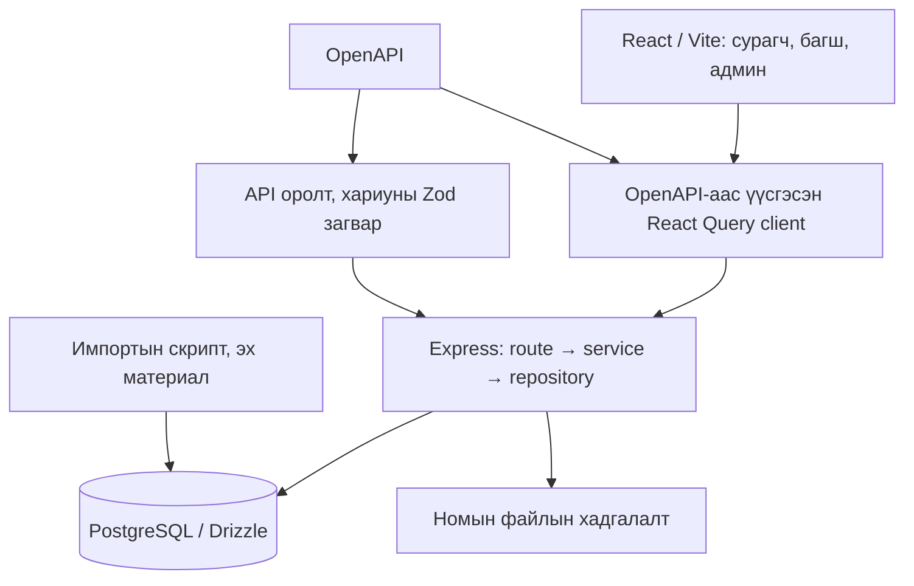

# Системийн нэгдсэн судалгаа — 2026-09-23

Энэ баримт шаардлага, хэрэгжилт, локал өгөгдлийн санг тулгаж үзсэн судалгаа. Production орчны баталгаажуулалт биш. Судалгааны үеэр ажлын мод болон өгөгдөл өөрчлөгдөж байсан тул доорх тоонууд тухайн мөчийн зураглал болно. Хувийн мэдээлэл, нэвтрэх мэдээлэл оруулаагүй.

## 1. Бүтээгдэхүүний зорилго

Сургууль бүхэлдээ ашиглах, үе шаттай өсөх систем. Ойрын үндсэн урсгал нь **багш ажил төлөвлөх → сурагч гүйцэтгэх → багш үр дүнг харах → шаардлагатай дэмжлэг өгөх**. Хуваарь, ном, оношилгоо, ахиц нь энэ урсгалыг дэмжинэ.

Нэг хөгжүүлэгч хэрэгжүүлж, өгөгдөл импортолж, ашиглалтыг давхар хариуцаж байгаа нөхцөлд шинэ дэлгэцийн тооноос илүү нэг ажлыг эхнээс нь дуустал гүйцэтгэж болох эсэх чухал. Одоогийн бүтцийг бүхэлд нь дахин бичих шаардлага энэ судалгаагаар тогтоогдоогүй.

Эх сурвалж: [зорилго](requirements.md), [хөгжүүлэлтийн нөхцөл](development-foundation.md), [сценари](scenarios.md), [менежертэй тохирсон зүйлс](client-questions.md).

## 2. Архитектур

| Хэсэг | Байршил / үүрэг |
|---|---|
| Веб | `artifacts/ej-learning`: сурагч, багш, админы хуудас |
| API | `artifacts/api-server`: нэвтрэлт, эрх, сургалтын дүрэм, өгөгдөл унших/бичих |
| Гэрээ | `lib/api-spec`: OpenAPI; generated client болон Zod үүнээс үүснэ |
| Өгөгдөл | `lib/db`: schema, migration; core/content/learning/assessment/audit/staging |
| Ашиглалт | `deploy`, CI workflow: build, test, Docker, nginx тохиргоо |
| Эх материал | `local-data` болон файлын хадгалалт: импорт, ном, локал туслах материал; Git-д ороогүй файлыг тусад нь нөөцлөх шаардлагатай |

API нь үүрэг болон багшийн анги/хичээлийн эрхийг шалгадаг. UI дээр товч нуух нь эрхийн үндсэн хамгаалалт биш. Ангийн багшийн харах эрх, хичээлийн багшийн засах эрх, админы эрхийг тус тусад нь авч үзэх хэрэгтэй.

## 3. Сургалтын хоёр урсгал

### Ангийн нийтлэг сургалт

Анги, элсэлт → долоо хоногийн хуваарь → огнооны агуулга → номын хэсэг/хуудас → сурагчийн гүйцэтгэл → чадварын үнэлгээ → нөхөх ажил.

`timetable_slots` нь давтагддаг цаг; `class_schedule` нь тухайн огнооны агуулга болон нэмэлт хичээл. Агуулгагүй цаг ч харагдах ёстой. Нэг хичээл өдөрт хоёр удаа орвол хоёр цаг. Сонгон болон хуваагдсан цагт сурагчийн хамрагдалт тусдаа асуудал.

### Англи хэлний түвшинд суурилсан нэмэлт сургалт

CEFR оношилгоо → түвшин → pathway → сурагчийн төлөвлөгөө → writing/speaking-ийн багшийн үнэлгээ.

Энэ нь англи хэлний бүх нийтлэг хичээлийг орлохгүй. Түвшний импорт болон өдөр тутмын хичээлийн чадварын үнэлгээ өөр өгөгдлийн урсгалтай; автоматаар нэг болсон гэж үзэж болохгүй.

### “Хувийн төлөвлөгөө” гэсэн гурван өөр ойлголт

1. Импортолсон түвшний сургалтын төлөвлөгөө: `study_plan_weeks`, `study_plan_days`.
2. Багш/системээс оноосон нэмэлт ажил: `student_assignments`.
3. Сурагч өөрөө бичих хувийн өдрийн төлөвлөгөө: `student_day_plans`.

Эхний хоёрын UI байна. Гурав дахь ойлголтын API байгаа ч судалсан frontend-д түүнийг ашиглах үндсэн зам олдоогүй. Нэр болон навигацыг эдгээр утгатай тулгаж цэгцлэх хэрэгтэй.

## 4. Локал өгөгдлийн бодит байдал

2026-09-23-ны уншилт; эдгээр тоо production-ийн үзүүлэлт биш.

| Хэсэг | Ажиглалт | Утга |
|---|---|---|
| Сурагч, анги | 292 сурагчийн бүртгэл; 247 идэвхтэй/элсэлттэй; 14 анги | Сургуулийн үндсэн бүртгэл орсон |
| Багш | 32 бүртгэл, 30 идэвхтэй; хуваарьт 26 | Нийт багшийн тоо ба хуваарьтай багшийн тоо өөр |
| Хуваарь | 552 цаг, 10 хонхны цаг | Долоо хоногийн суурь өгөгдөл байна |
| Огнооны агуулга | 29 мөр, нэг анги, timetable slot-той холбогдсон | Бүх ангид агуулга орсон гэсэн үг биш |
| Өдрийн хичээл | 31 approved; бүгд DEMO/MOCK угтвартай код | Бодит хэрэглээнд баталсан агуулга мөн эсэхийг гарал үүслээр нь шалгах хэрэгтэй |
| Ном | 11 approved материал, 99 outline хэсэг | Номын бүтэц орсон; бүх хичээлийн агуулгыг бүрэн хангахгүй |
| Асуулт | 84 асуулт; skill_id холболт 0 | Өдрийн quiz-ийн чадвараар хайх query эдгээрийг олж чадахгүй |
| CEFR | 62 сурагчийн 66 attempt; RECONSTRUCTED эх үүсвэртэй | Импортолсон үр дүн; бүгдийг шинэ веб шалгалт гэж үзэхгүй |
| Түвшний төлөвлөгөө | 60 сурагч; 1440 skill/week мөр, 1200 day мөр | 1440 календарийн долоо хоног гэсэн тоо биш |
| Өдөр тутмын гүйцэтгэл | quiz_attempts, student_skill_mastery, student_assignments тус бүр 0 | Ахиц/нөхөх ажлын бодит хэрэглээ хараахан бүрдээгүй |
| Багшийн productive үнэлгээ | 0 | Код байгааг үнэлгээ хийгдсэнтэй андуурч болохгүй |
| Хуваагдсан цагийн сурагчид | timetable_slot_students 0 | Сурагчийн сонголтын бодит бүртгэл дутуу |

Speaking club, ДС-1, БС-ийн үлдсэн 10 цагийг хэрэглэгчийн заавраар хойш тавьсан. Одоогийн ажлын саад, заавал шийдэх асуудалд тооцохгүй.

## 5. Алдаа, өгөгдлийн дутуу байдал, дараагийн боломжууд

### Батлагдсан ажиллагааны алдаа

- Судалгаанаас өмнөх шалгалтаар ажиллаж байсан API хуучин `subjects` хариу өгч, шинэ frontend `slots` хүлээж байв. Энэ нь “Өнөөдөр” ажиллахгүй байх бодит шалтгаан байсан. Серверийг шинэчилсний дараа локал API шалгалт амжилттай болсон. API dev watcher-ийн өөрчлөлт үүнийг дахин үүсэхээс сэргийлэх зорилготой.
- Судалгааны үеийн `student-content/repository.ts` дотор `subjectOutline` query-ийн `ORDER BY ... LIMIT 1` нь `UNION ALL`-ийн өмнө хаалтгүй байна. Query-г локал PostgreSQL дээр унших байдлаар ажиллуулахад `42601: syntax error at or near "UNION"` гарсан. Хичээлийн агуулгын жагсаалт нээгдэхэд саад болно. Судалгаа эхэлснээс хойш энэ кодыг засаагүй.

### Өгөгдөл, холбоосын дутуу байдал

- Асуулт–чадварын холбоос байхгүй тул “асуултын сан байна” гэдэг нь “өдрийн хичээл дээр шалгалт ажиллана” гэсэн баталгаа болохгүй.
- Бүх ангийн цагт баталсан агуулга бэлэн биш. Агуулгагүй үед дэлгэц зөв мэдээлэл үзүүлэх ба багш агуулга бэлтгэх боломж хоёр тусдаа шалгуур.
- Сонгон/хуваагдсан цагийн хамрагдалтыг бодитоор бүртгээгүй. Сурагчид автоматаар дурын бүлэг оноож болохгүй.
- Ахиц, нөхөх ажил хоосон байгаа нь заримдаа гүйцэтгэл ороогүйгээс үүднэ. Хоосон төлөв ба API алдааг UI ялгах ёстой.

### Хэрэгжилтийн дутуу холбоос, дахин шалгах зүйл

- Өдрийн хичээл, асуулт, чадварыг үүсгэж батлах багшийн бүрэн ажиллагаа судалсан route/UI-д бүрдээгүй; импорт, скриптээс хамаарал их. Энэ нь ганц хөгжүүлэгчийн байнгын гар ажиллагааг нэмэгдүүлнэ.
- Хуучин assignment/dashboard урсгалын зарим API readOnly болон тогтмол утгатай. Тэдгээрийг шинэ сургалтын гүйцэтгэлийн замтай зэрэгцүүлэн “бүрэн ажиллаж байна” гэж тооцохгүй.
- Quiz attempt, mastery, remediation хадгалалт нэг бүхэл transaction биш харагдсан. Завсрын алдааны үед төлөв зөрөх эсэхийг тусгайлан шалгах шаардлагатай; энэ судалгаагаар эвдрэл давтаж гаргаагүй.
- Productive үнэлгээ дуусахад placement-ийн эх үүсвэрийн төлөв солигддог. Хүний үнэлгээ дууссан эсэх ба анхны хариуны найдвартай байдал өөр ойлголт тул дүрмийг тулгах хэрэгтэй.
- Ахицын тайлбар болон кодын давталтын нөхцөл хооронд зөрүү байна. Хуучин баримтууд ч шинэ schema/дүрмээс хоцорсон хэсэгтэй.

### Одоогийн үндсэн урсгалд заавал нэмэхгүй зүйл

Google Workspace нь бодит холболтгүй; мэдэгдэл нь бүрэн хүргэлтийн системгүй. Эцэг эхийн хэрэглээ, өргөн тайлан болон бусад сургуулийн үйл ажиллагаа дараагийн хүрээ. Эдгээрийг эхний сургалтын урсгалын өмнө хийх шаардлагагүй.

## 6. Ганцаараа хөгжүүлэхэд тохирох дараалал

1. **Одоогийн сурагчийн өдөр:** нэвтрэх → Өнөөдөр → зөв цаг → хичээл → зөв номын хуудас. Runtime алдааг арилгаж, агуулгатай/агуулгагүй/давхар цаг/сонгон гэсэн тохиолдлыг шалгана.
2. **Багшийн нэг бүтэн ажил:** анги/цаг сонгох → агуулга өгөх → сурагчид харагдах → засах/цуцлах. Хөгжүүлэгч скрипт ажиллуулахгүйгээр хийх ёстой.
3. **Гүйцэтгэл ба үр дүн:** баталсан асуултыг зөв чадварт холбох → сурагч өгөх → хариу хадгалах → багш үр дүн харах. Туршилтын өгөгдлөөр эхлээд бүтэн мөчлөгийг батална.
4. **Нэмэлт сургалт:** нийтлэг хичээл, CEFR төлөвлөгөө, нөхөх ажлыг ойлгомжтой ялгаж; productive үнэлгээ болон хамрагдалтыг гүйцээнэ.
5. **Ашиглалт:** тогтвортой хувилбар, migration, файл+DB нөөцөөс сэргээх шалгалт, алдааг илрүүлэх боломж. Remote орчин болон сэргээх ажиллагааг энэ судалгаанд баталгаажуулаагүй.

“Дууссан” гэсэн шалгуур нь зөвхөн typecheck/test/build биш: багшийн хадгалсан өөрчлөлт зөв сурагчид харагдаж, сурагчийн хийсэн ажил дахин нэвтрэхэд хадгалагдаж, багш үр дүнг нь харж чаддаг байх.

## 7. Шалгалтын хязгаар

Өмнөх засварын хувилбаруудад 86 API, 12 frontend тест амжилттай; 14 ангийн төлөөллийн API уншилт болон нэмэлт унших шалгалтууд амжилттай байсан. Үүнээс хойш ажлын мод өөрчлөгдсөн тул эдгээрийг одоогийн бүх кодын шинэ баталгаа болгож ашиглахгүй. Шинэ SQL алдаа үүний бодит жишээ.

Browser-ийн URL-ийг Computer Use найдвартай тогтоож чадаагүй тул UI автомат шалгалт зогссон. Дэлгэцийн эцсийн харагдац, товшилтын бүтэн урсгалыг энэ судалгаанд баталгаажуулаагүй.

Судалгааны шатанд application кодод нэмэлт засвар хийгээгүй; энэ баримтыг дараагийн засварын суурь болгож хадгалав.
